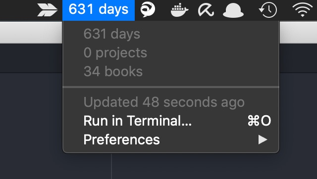

# BitBar Death Clock Plugin

This is what it looks like


Install https://github.com/matryer/bitbar if you haven't.
Put [DClock.sh](DClock/DClock.sh) into your plugin directory.

Put up your configuration file at ~/.dc_config.cfg in the following format:

```bash
DEATH_DATE_STR="2025-11-07"
BOOKS_A_YEAR=20
```

where DEATH_DATE_STR denotes your personal death date in %Y-%M-%d format,
and BOOKS_A_YEAR the amount of books you read in a given year.
